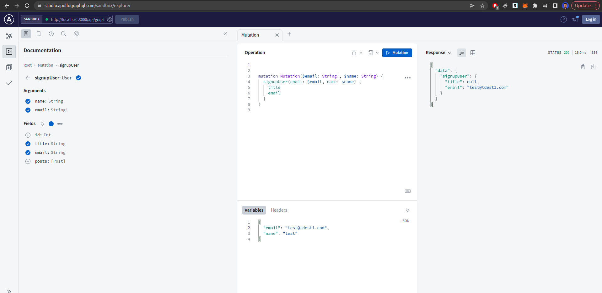

# Setup
1. `npx create-next-app@latest learning-graphql-prisma --ts`
2. `npm i --save-dev @types/micro-cors prisma prettier`
3. `npm i @ant-design/icons @next-auth/prisma-adapter @prisma/client antd micro apollo-server-micro graphql graphql-scalars micro-cors next-auth nexus ts-node
4. `npm i @apollo/client --legacy-peer-deps`
5.  `npx prisma init`
6.  Setup Local postgres DB or container, add url to env
7.  Add Apollo server (pages/api/graphql.ts) and client (pages/_app.tsx)
8.  https://next-auth.js.org/adapters/prisma#create-the-prisma-schema - Add User and other auth related Schema
9.  `npx prisma migrate dev` - Runs migration and creates schema in db instance
10. Setup Github app for oauth https://github.com/settings/developers, add Client and Secret to .env
11. Define graphql server, client and schema
12. GraphQL studio:
 
1.  Add Github auth https://next-auth.js.org/providers/github
2.  Add Prisma client in lib/prisma.ts https://next-auth.js.org/adapters/prisma
3.  Typescript assignment error https://stackoverflow.com/questions/54496398/typescript-type-string-undefined-is-not-assignable-to-type-string